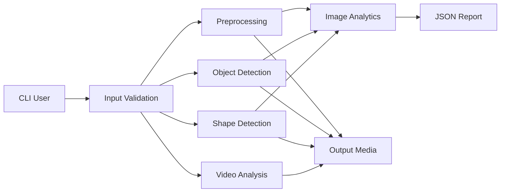

# System Architecture

## Components
- `main.py`: command-line routing and validation.
- `preprocessing.py`: image transformations.
- `object_detection.py`: Haar-cascade face detection.
- `shape_detection.py`: contour extraction and classification.
- `image_analysis.py`: image statistics.
- `video_analysis.py`: motion detection using frame differencing.
- `report_generator.py`: structured JSON output.
