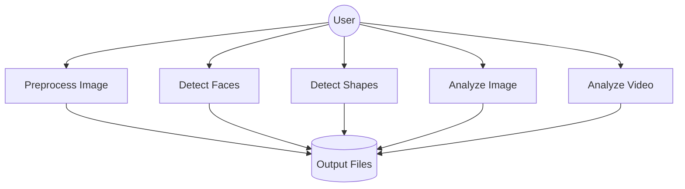
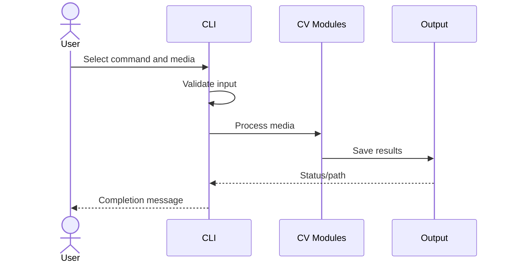

# Workflow and UML-Style Views

## Workflow
1. User supplies media path and operation.
2. System validates the input.
3. OpenCV loads the media.
4. The selected vision pipeline processes it.
5. Features/statistics are calculated.
6. Annotated media and reports are saved.
7. CLI displays completion status or an error.

## Use Cases

## Sequence Diagram

